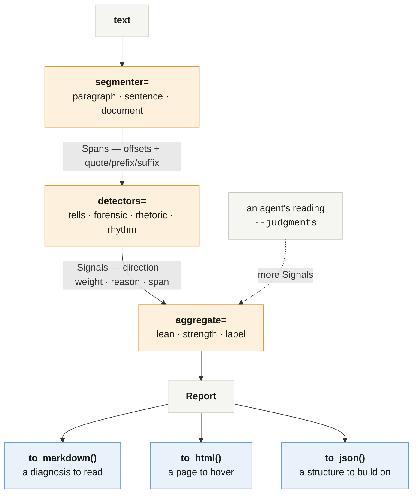

# ductus

Gauge which parts of a text read as machine-written, and say why — with every finding anchored to the exact characters that carry it.

```python
from ductus import gauge

report = gauge(open("draft.md").read())
report.document.label  # 'mixed-signals'
report.segments[3].lean  # +0.62  (-1 human … +1 machine)
report.segments[3].signals[0].note
# "a colon introducing a three-part parallel enumeration -- a textbook assistant construction"
```

```bash
pip install ductus
ductus gauge draft.md                                  # a readable diagnosis
ductus gauge draft.md --format html --out report.html  # shaded, hover for the reason
ductus gauge draft.md --format json                    # for a program
```

In palaeography the *ductus* is the characteristic manner and sequence of strokes by which a scribe's hand is recognised. This package looks for the equivalent in prose.

## There is no percentage in this package, and that is the point

Every detector on the market emits a number like "87% AI". That number reads as a calibrated probability, is not one, and is how people get falsely accused. What you get here instead is three things you can argue with: a **lean** in [-1, +1], an **evidence strength**, and a coarse **label**. Behind each of them is a list of signals, each with a direction, a weight, the detector that produced it, a plain-language reason, and the exact span it came from.

Four things are true and belong in any report you make from this:

- **Heavily-edited human writing and model-assisted writing look the same.** Re-reading a hard message ten times sands off exactly the irregularity that marks it as human.
- **Detectors over-flag non-native English writers** — 61.3% false positives across seven commercial detectors on non-native TOEFL essays, against near-zero on native-speaker controls [1].
- **Register contamination is real**: people who read model output all day start writing like it, unassisted.
- **No detector survives a motivated adversary**, and that is a proven result rather than a gap in current tooling [2].

So this package describes *text*. It does not make claims about *people*, and it should not be used to.

## What it looks at

Four detectors ship, all deterministic, all free, none needing a model or a key.

| Detector | Finds | Example |
|---|---|---|
| `tells` | Catalogue phrases models overuse, tiered by confidence | "delve", "it's important to note", "In conclusion," |
| `forensic` | Mechanical traces of how the text was produced | a hard line break mid-sentence, mixed straight-and-curly apostrophes, trailing whitespace, em-dash density |
| `rhetoric` | Sentence *shapes* a phrase list cannot see | "not X but Y", a colon introducing a three-part parallel enumeration, concession-then-pivot |
| `rhythm` | Burstiness — how much sentence length varies | metronomic paragraphs |

Note that several of these argue *for* a human. A detector that can only ever accuse is not a measuring instrument. In practice the mechanical signals are often the most decisive thing in a file, in either direction.

The deterministic pass finds phrases, artifacts and a few shapes. **It cannot find prose that is machine-written and bland** — for that a model has to read it, which is what the shipped agent skills are for.

## How it fits together



The three amber boxes are the seams — each is one keyword argument. Everything below `Report` is a renderer, and renderers are pure functions of it: nothing in the analysis knows or cares which one you call, and adding a fourth changes nothing upstream.

## Renderings

One analysis, three outputs. Pick by who is reading.

| Renderer | CLI | Output | Reach for it when |
|---|---|---|---|
| `to_markdown(report)` | `ductus gauge draft.md` | A synopsis, a table of flagged segments, then a *Why* section quoting each signal and its reason | A terminal, a PR comment, a document, an agent that needs to reason about the result in prose |
| `to_html(report, text=…)` | `--format html --out report.html` | One self-contained file — no build step, no CDN, no network | You want to *see* where the evidence is, and read why without losing your place |
| `to_json(report)` | `--format json` | The full structure: every span, signal, weight and reason | A frontend, a pipeline, a calibration run, anything that is not a person |

### The HTML rendering


Hover (or keyboard-focus) any highlight and the reason appears beside it — which detector fired, which direction it argues, and what it weighs. Paragraphs carry a left border and a lean badge; the bar under each one is its evidence, one segment per signal.

Two deliberate choices, both from the annotation-systems research in [`misc/docs/research/`](misc/docs/research/annotation-editing-ux.md):

- **Hue encodes score, and only score.** A perceptually-uniform ramp, warm for machine-leaning and cool for human-leaning, with lightness re-clamped per theme so it works in light and dark mode. Overlap is shown *structurally*, in the lane under the paragraph, never by blending colours — stacking translucent fills is what makes overlapping highlights unreadable.
- **The reason is anchored to the highlight**, not parked in a corner, so the eye does not have to leave the text to find out why. Below 640px it falls back to a bottom sheet.

The GIF above was recorded with [`walkthru`](https://github.com/thorwhalen/walkthru) driving a real browser — the script is [`misc/demo/make_gif.py`](misc/demo/make_gif.py), and it is the whole pipeline: measure where the highlights are, build a demo document whose camera zooms to them, play it against a recording page, render the capture to a GIF.

## Agent skills

The primary surface. Two skills and a subagent ship inside the package and install with one command:

```bash
ductus install-skills --write          # links them into ~/.claude/skills
```

- **`ductus`** — what may and may not be claimed from a text, and which task is which.
- **`ductus-gauge`** — the full reading: the deterministic scan, then a judgment pass with rubrics for the nine machine-leaning and six human-leaning *shapes* that regular expressions miss, then the write-up.
- **`ductus-reader`** (subagent) — does the whole reading in its own context and returns a finished diagnosis.

An agent's own reading folds back in beside the deterministic signals, anchored by quote:

```bash
ductus gauge draft.md --judgments judgments.json --format html --out report.html
```

A quote that no longer occurs is dropped rather than mis-anchored, so re-running after an edit is safe.

## Seams

Three, each one keyword argument, each defaulting to something that genuinely works:

```python
gauge(text, segmenter="sentence")  # or "paragraph", "document", or a callable
gauge(
    text, detectors=["forensic", "rhetoric"]
)  # or your own (text, span) -> Iterator[Signal]
gauge(text, aggregate=my_calibrated_scorer)  # replace the scoring model wholesale
```

A detector is a plain function `(text, span) -> Iterator[Signal]`. There is no base class and nothing to register. Adding Fast-DetectGPT, Binoculars or a vendor API means writing one more function of that shape — see [the roadmap](misc/docs/roadmap.md).

For long documents, `iter_segments` is the streaming core and `gauge` is the batch facade over it.

## Spans survive editing

Every `Span` carries character offsets *and* the W3C Web Annotation redundant selectors (`quote`, `prefix`, `suffix`), because plain offsets do not survive an edit to the text. That is what lets a viewer re-find a finding after the document changed, and what a future edit-and-re-score UI is built on.

## Relationship to `deslop`

`ductus` is the read side: *where does this text read as machine-written, and why*. [`acquaint`](https://github.com/thorwhalen/acquaint)'s `deslop` is the write side: *make my draft not read that way, in my voice, calibrated to this reader*. They share this package's tells catalogue — `acquaint` imports it — and compose naturally: gauge, deslop the flagged spans, gauge again.

They are separate packages because they have different inputs. `deslop` needs a model of the reader; `ductus` must work on a stranger's text with nothing but the text.

## Install

```bash
pip install ductus              # the core: pyyaml and cw, nothing else
pip install "ductus[local]"     # + model-based detectors, offline, no API key
pip install "ductus[api]"       # + vendor detector adapters
```

## References

[1] [Liang W, Yuksekgonul M, Mao Y, Wu E, Zou J. GPT detectors are biased against non-native English writers. *Patterns* 2023.](https://arxiv.org/abs/2304.02819)

[2] [Sadasivan VS, Kumar A, Balasubramanian S, Wang W, Feizi S. Can AI-Generated Text be Reliably Detected?](https://arxiv.org/abs/2303.11156)

[3] [Sanderson R, Ciccarese P, Young B. Web Annotation Data Model. W3C Recommendation, 2017.](https://www.w3.org/TR/annotation-model/)

[4] [Tolstykh I, et al. LLMTrace: A Corpus for Classification and Fine-Grained Localization of AI-Written Text. arXiv:2509.21269.](https://arxiv.org/abs/2509.21269) — the ground-truth fixture in `tests/fixtures/` is a slice of this, Apache-2.0.
